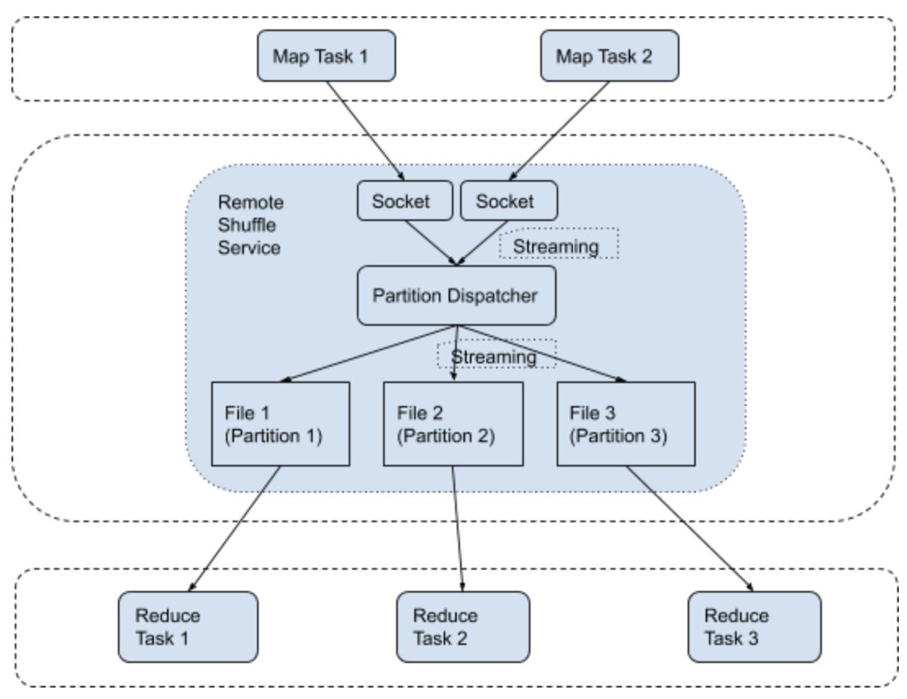
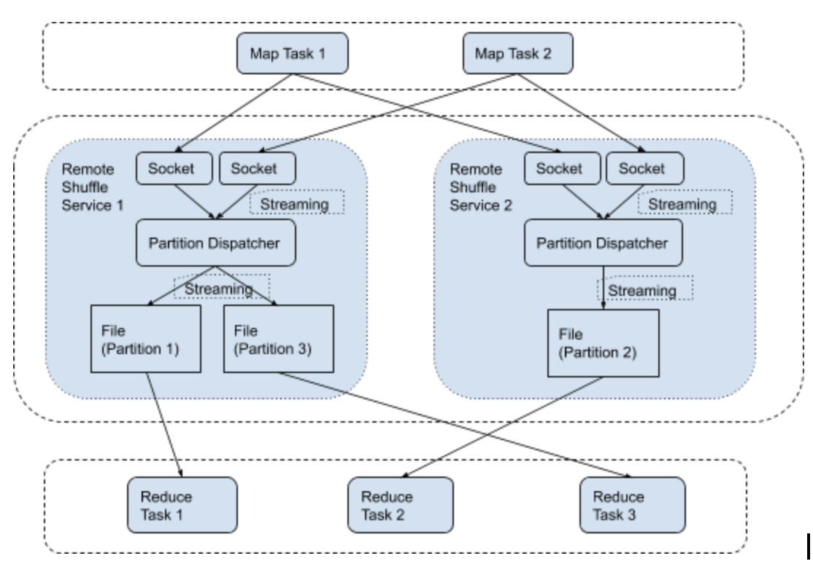

# Server High Level Design

The Remote Shuffle Servers are dedicated servers running on standalone hosts (not same hosts as Apache Spark executors). 
They provide following functionalities:

- Accept shuffle data from shuffle writer client
- Save shuffle data to local disk (or HDFS/S3 which could be added in future)
- Send shuffle data to shuffle read client

The goal is to improve the elasticity of Apache Spark applications.

In current open source Apache Spark implementation, the shuffle data is stored on the executor's host. If the executor 
host is dead, the shuffle data is gone, and the application has to re-run the previous whole stage to generate shuffle 
data again.

With Remote Shuffle Service, if the executor is dead, the shuffle data is still on the dedicated shuffle server, and 
the application can continue to run by reading shuffle data from the shuffle server. There is no need to re-run the 
previous whole stage.

## Basic Design with One Shuffle Server

The basic idea is shuffle clients send shuffle records to Remote Shuffle Service in a streaming style, and the shuffle 
service writes the records to different partition files based on the records’ partition id.

The following diagram illustrates how it works when there is only one shuffle server:

Each map task will steam the shuffle data to the Remote Shuffle Service. The shuffle data stream is a sequence of 
shuffle records, where each record contains a partition id and record data (blob).

When Remote Shuffle Service gets a shuffle record from map task, it inspects the record’s partition id, chooses 
different local file (based on that partition id), and writes record blob to the end of that file. In the upper chart 
example, there are 3 partitions. All records of partition 1 are written to file 1. All records of partition 2 are 
written to file 2. All records of partition 3 are written to file 3.

When all map tasks finish, the shuffle data will be written into multiple files. Each file contains the whole data 
belonging to the same partition.

When the reducer task fetches data, it connects to Remote Shuffle Service and provides a reducer id (partition id). 
Remote Shuffle Service will use that reducer id (partition id) to find the corresponding file and send the whole file 
to the reducer.

## Scale Out with Multiple Shuffle Servers

We could add more Remote Shuffle Service instances to horizontally scale out the system. Following is an example of two 
Remote Shuffle Service instances:

Each map task connects to all Remote Shuffle Service instances. For each shuffle record inside each map task, the map 
task inspects the record’s partition id, chooses a corresponding Remote Shuffle Service instance for that partition, 
and sends the record to that server.

Each Remote Shuffle Service instance does not know other instances. It only accepts a shuffle record from the map task, 
and writes the record to the file corresponding to that record’s partition. This is to make sure the whole system is 
horizontally scalable.

In the upper example, Map Task 1 connects to both Remote Shuffle Service instances. It sends shuffle records of 
partition 1 and partition 3 to the first Remote Shuffle Service instance, and sends shuffle records of partition 2 to 
the second Remote Shuffle Service instance.

In terms of how to decide which partition goes to which Remote Shuffle Service instance, there could me multiple 
strategies. The easiest strategy is hash based: Remote_Shuffle_Service_Instance_Id = Partition_Id % Count_of_Servers. 
Then reducer tasks will also use this hash based information to determine which server to connect to fetch its data, 
based on its reducer id (partition id).

## Performance Optimization

The Streaming Based Remote Shuffle Service writes shuffle data to remote shuffle servers. Its performance might be 
slowed down comparing with writing to local disk. 

There are many techniques we could use to optimize the performance, based on the fact that modern network hardware 
normally has high bandwidth but with high latency (comparing with local disk write). Following is a short list of 
possible optimizations:

- Utilize high network bandwidth, e.g. write data as fast as possible and reduce waiting for server response.
- Reuse network connections to reduce the overhead of network latency.
- Write data in batches to avoid small network packets

This [Spark Summit 2020 Talk](https://databricks.com/session_na20/zeus-ubers-highly-scalable-and-distributed-shuffle-as-a-service) 
gives more details about how Uber optimizes their Remote Shuffle Service and runs it in production.

